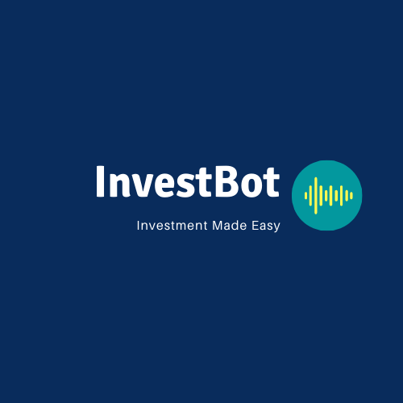

# InvestBot

Problem Statement:

The world of internet has become an integral part of our daily life.

A large number of tech savvy college students and millennials have opened up brokerage accounts, inspired by the idea of FIRE (financial independence and retire early).

However, with increased popularity of robo advising, no one has yet to deliver an one stop shop for financial data, news, portfolio customization and execution.  

# Our Solution
We are InvestBot, the next generation robo advisor and cutting edge investment tool!

Our app is available on your smart devices: Amazon Alexa, Google Home, iPhone, iPad, Android phones, etc. 
We are backed by extensively tested machine learning technology,  gone thru years of backtesting.

We leverage Amazon Developer Console, AWS Data Exchange to deliver a world class tool with:
  - Conversational interface (voice or text).
  - One stop shop for portfolio simulation, financial data, news and connection to brokerage account for real time trade execution and reporting. 
  - Bonus: financial dictionary for newbies

# Use Cases
User: “Alexa, tell me about Apple”
Amazon: “Today’s analysis indicates ‘Buy’.”

User: “Alexa, add Microsoft to my portfolio.”
Amazon: “Microsoft added to portfolio.”

User: “Alexa, remove Nike from my portfolio.”
Amazon: “Nike removed from portfolio.”

User: “Alexa, change my risk tolerance to ‘Moderate’.”
Amazon: “Risk tolerance is now ‘Moderate’.”

User: “Alexa, change my trading horizon to ‘Short-Term’.”
Amazon: “Trading horizon is now ‘Short-Term’.”

User: “Alexa, please setup an alert when Apple stock price changes by 5%.”
Amazon: “Alert set when Apple stock price changes by 5%.”

# Questions to answer

- Provide adhoc portfolio simulation / management capabilities
- Provide real time stock quote and news
- Provide buy/sell/hold recommendations based on machine learning models
- Provide real time alerts related to price change, breaking news, recommendation change, etc.

# Tools/Modules to use
Amazon Development Console
AWS Lex
AWS Lambda
AWS Sagemaker
Python
Machine learning models
Matplotlib
NumPy
SciPy
etc.

# Who We Are
Aaron Montano
Ally Che
Ryan Felder

---
